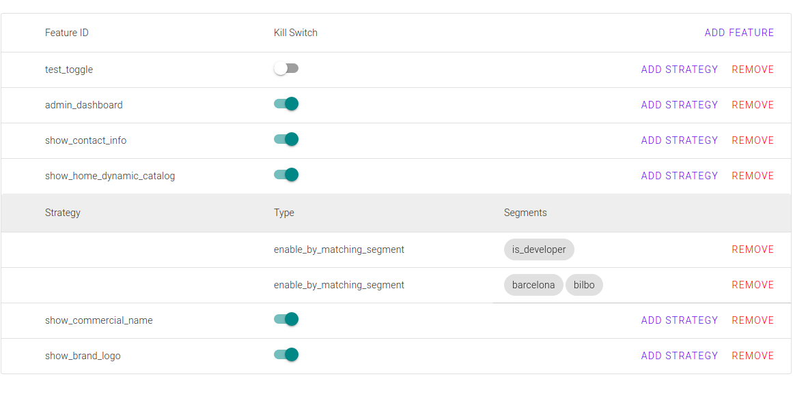

# Toggle UI

Pheature flags Web Component based Admin UI implementation



## Requirements

* yarn

## Installation

This is an experimental feature, you should clone it from git.

```bash
git clone git@github.com:pheature-flags/toggle-ui.git
```

## Usage

See [the html index](index.html) file.

```html
<toggle-list api-url="http://127.0.0.1:3000"></toggle-list>
```

## Contributing

Your contributions are always welcome! Please have a look at the [contribution guidelines](./CONTRIBUTING.md) first.

## License

We really believe in the Open Source Software, we built our carers around it, and we feel that we need to return our
knowledge to the community. For this reason we release all our packages under [BSD-3-Clause licence](./LICENSE.md). 

